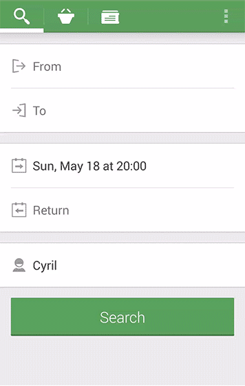

# Animation-with-fragment
idea from custom-animations-with-fragments and Code refrence from https://git.mika-dev.com/Mika/custom-animations-with-fragment
I add click listener in "editmode",and  handle bugs when Double clicking sticky item

See [Sample](http://www.cyrilmottier.com/2014/05/20/custom-animations-with-fragments) for more details.

## Credits

* Inspired by `custom-animations-with-fragments` in [code](https://git.mika-dev.com/Mika/custom-animations-with-fragment).

